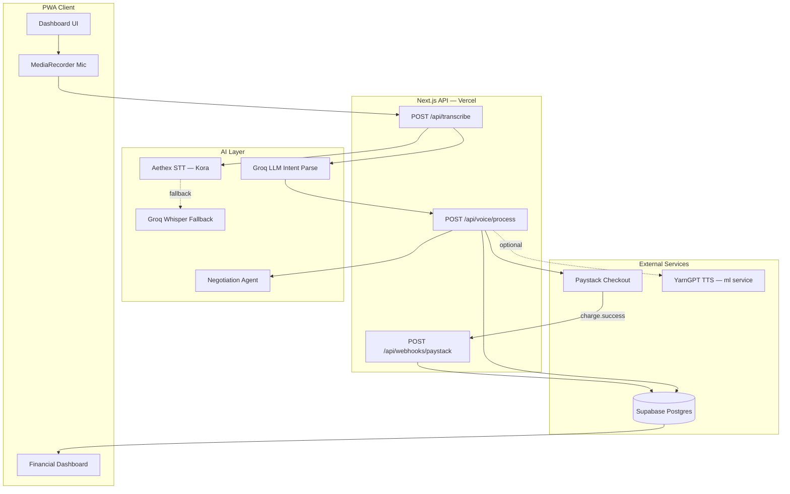
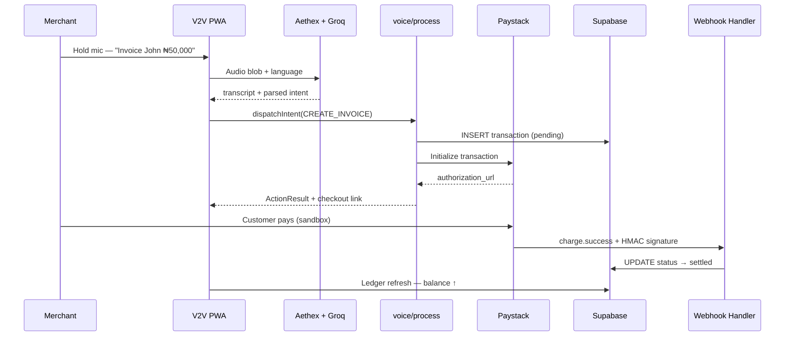

<div align="center">

# V2V — Voice-to-Value Autonomous Merchant Protocol

**A voice-first financial operating layer for informal merchants across Africa and the Middle East.**

*Built for the YPIT Hackathon*

<br />

[](https://nextjs.org/)
[](https://www.typescriptlang.org/)
[](https://supabase.com/)
[](https://paystack.com/)
[](https://vitest.dev/)
[](https://web.dev/progressive-web-apps/)
[](LICENSE)

**[Live Demo](https://v2v-xi.vercel.app)** · **[Dashboard](https://v2v-xi.vercel.app/dashboard)** · **[Demo Runbook](./DEMO_RUNBOOK.md)**

</div>

---

## Table of Contents

- [Overview](#overview)
- [The Problem & The Mission](#the-problem--the-mission)
- [Target Persona](#target-persona)
- [Core Capabilities](#core-capabilities)
- [System Architecture](#system-architecture)
- [Voice Pipeline](#voice-pipeline)
- [Tech Stack](#tech-stack)
- [Quick Start](#quick-start)
- [Environment & Security](#environment--security)
- [API Reference](#api-reference)
- [Intent Contract](#intent-contract)
- [Demo Walkthrough](#demo-walkthrough)
- [Testing & CI](#testing--ci)
- [Deployment](#deployment)
- [Project Structure](#project-structure)
- [Engineering Team](#engineering-team)
- [Roadmap](#roadmap)
- [License](#license)

---

## Overview

**V2V (Voice-to-Value)** is a production-oriented **Progressive Web App (PWA)** that converts spoken business intent into deterministic financial actions: **invoices**, **balance checks**, **B2B negotiations**, and **workspace bookings** — settled through **Paystack** and recorded on a **Supabase-backed operational ledger**.

The system is **software-first** with a **bits-and-atoms** application layer: voice commands issued during a physical delivery at **Café One Yaba, Lagos** can instantly generate a Paystack checkout link, update the merchant ledger on settlement, and surface real-time balance — without opening a traditional banking app.

| Property | Detail |
|----------|--------|
| **Architecture** | Next.js App Router — unified frontend + API on Vercel |
| **Voice ingress** | Browser `MediaRecorder` → Aethex STT → Groq intent parse |
| **Orchestration** | `dispatchIntent()` — invoice, balance, negotiation agent |
| **Settlement** | Paystack `charge.success` webhooks → Supabase ledger |
| **Languages** | English · Nigerian Pidgin · Yoruba · Arabic (STT + invoice metadata) |
| **Response envelope** | `{ ok, data \| error }` + `x-request-id` on every route |

---

## The Problem & The Mission

Informal wholesale merchants — especially women-led suppliers moving high-volume goods through urban hubs — conduct business **orally**. They negotiate in the aisle, invoice on the move, and collect payment under time pressure. Traditional fintech UIs demand visual attention, form fields, and literacy assumptions that break down during fast-paced physical deliveries.

**V2V closes the gap between oral commerce and formal financial infrastructure.**

| Pain | V2V Response |
|------|----------------|
| App friction during deliveries | Single hold-to-talk mic — no forms |
| Code-switching (English / Pidgin / Yoruba / Arabic) | Aethex dialect-aware STT + Groq JSON extraction |
| Invoice → payment latency | Paystack `authorization_url` in under 2 seconds |
| No audit trail | Immutable Supabase transaction log with webhook settlement |
| B2B price negotiation | Stateful negotiation agent with session persistence |

> **Mission:** Transition merchants from passive digital exclusion to **active financial independence** — voice in, value out.

---

## Target Persona

**Alhaja Kudirat** — 45-year-old informal wholesale supplier delivering bulk goods to urban hubs including **Café One, Yaba, Lagos**.

- Prefers **oral** business communication over typing
- Faces **extreme friction** with traditional fintech interfaces during deliveries
- Needs **instant invoices**, **balance visibility**, and **negotiation** without stopping the truck

V2V is designed for Kudirat first — and scales to any orally-driven merchant in emerging markets.

---

## Core Capabilities

### Browser-Native Voice Ingestion

High-visibility **hold-to-record** UI built on `MediaDevices` + `MediaRecorder`. Handles mobile audio formats (`webm`, `m4a`) with extension-aware uploads and Groq Whisper fallback when Aethex STT is unavailable.

### Multi-Lingual & Dialect Processing

| Module | STT (Aethex) | Use Cases |
|--------|--------------|-----------|
| **English** | `english` | Invoice · balance · negotiation |
| **Nigerian Pidgin** | `pidgin` | Informal regional syntax |
| **Yoruba** | `yoruba` | Localized command mapping |
| **Arabic** | `arabic` | Cross-border / MENA scalability |

Language selection flows through STT → invoice metadata → Paystack checkout display.

### Intelligent Intent Parsing

Groq LLM executes **strict JSON function-calling** schemas. Keyword/stub parser and optional ML seam (`INTENT_PARSER_MODE=ml`) provide deterministic fallbacks.

| Intent | Action |
|--------|--------|
| `CREATE_INVOICE` | Supabase row + Paystack checkout URL |
| `CHECK_BALANCE` | Aggregated settled balance (kobo → NGN) |
| `RUN_NEGOTIATION` | Agent counter-offers + session persistence |

### Financial Infrastructure

| Integration | Role |
|-------------|------|
| **Paystack (sandbox)** | `sk_test` checkout initialization · HMAC webhook verification |
| **Supabase Ledger** | Service-role server writes · `pending` → `settled` lifecycle |
| **Access Bank (simulated)** | Operational balance dashboard — settled credits only |
| **Café One** | Workspace booking → `CREATE_INVOICE` → Paystack checkout |

### YarnGPT TTS (ML Service)

Localized text-to-speech confirmations via the optional **`ml/`** Flask service (`POST /synthesize`). Wired for Nigerian-accent playback; main PWA returns structured text today with TTS as an extension point.

---

## System Architecture



### End-to-End Settlement Flow



---

## Voice Pipeline

```
Mic (HOME tab)
  │
  ▼
POST /api/transcribe
  ├── Aethex STT (primary) — language: english | yoruba | pidgin | arabic
  ├── Groq Whisper (fallback)
  └── Groq LLM → JSON intent (with keyword-parser fallback)
  │
  ▼
POST /api/voice/process
  └── dispatchIntent()
        ├── CREATE_INVOICE  → Paystack + Supabase + CheckoutModule
        ├── CHECK_BALANCE   → getBalance() + BalanceResultCard
        └── RUN_NEGOTIATION → stub/ML agent + NegotiationPanel
```

**Café One booking** bypasses the mic: `Book` button → same `voice/process` path with pre-built `CREATE_INVOICE` payload.

---

## Tech Stack

| Layer | Technology | Rationale |
|-------|------------|-----------|
| **Framework** | Next.js 16 App Router | Unified SSR + API routes on Vercel |
| **Language** | TypeScript 5 | End-to-end type safety |
| **UI** | Tailwind CSS 4 · shadcn/ui · Framer Motion | Mobile-first PWA with polished state transitions |
| **Validation** | Zod | Request + intent schema enforcement |
| **Database** | Supabase (PostgreSQL) | Ledger, negotiations, webhook idempotency |
| **Payments** | Paystack REST API | Sandbox checkout + signed webhooks |
| **STT** | [Aethex AI](https://developers.aethexai.com) | Dialect-fluent ASR for Africa & MENA |
| **LLM** | Groq (`llama-3.1-8b-instant`) | Low-latency JSON intent extraction |
| **Testing** | Vitest | Unit + integration (49 tests) |
| **PWA** | Service Worker (`sw.js`) | Installable shell · network-first HTML |
| **ML service** | Python Flask (`ml/`) | Optional STT/TTS/intent microservice |

---

## Quick Start

### Prerequisites

- Node.js 20+
- Supabase project (migrations applied)
- Paystack test keys (`sk_test_` / `pk_test_`)
- Aethex API key + Groq API key

### Install & Run

```bash
git clone https://github.com/Demiladepy/v2v.git
cd v2v
npm install
cp .env.example .env.local   # fill in values below
npm run dev
```

Open **http://localhost:3000** → **Login** → **Dashboard**.

### Database Migrations

Run in Supabase SQL Editor:

1. `supabase/migrations/0001_transactions.sql`
2. `supabase/migrations/0002_negotiations.sql`

Optional seed data:

```bash
npm run seed
```

### Verify

```bash
npm test                                    # 49 Vitest cases
npm run smoke -- http://localhost:3000      # API smoke
```

---

## Environment & Security

### Critical Security Rule

> **Never** prefix `SUPABASE_SERVICE_ROLE_KEY` with `NEXT_PUBLIC_`.

The service role key bypasses Row Level Security. It must **only** be read in server-side modules (`app/api/*`, `app/actions/*`, `lib/supabase/server.ts`). Importing it into any `"use client"` component would expose admin database access to every browser session.

| Variable | Client-safe? | Purpose |
|----------|:------------:|---------|
| `SUPABASE_SERVICE_ROLE_KEY` | **No** | Server-only ledger writes |
| `PAYSTACK_SECRET_KEY` | **No** | Checkout init + webhook HMAC |
| `AETHEX_API` / `GROQ_API_KEY` | **No** | STT + LLM (transcribe route) |
| `PAYSTACK_PUBLIC_KEY` | Yes | Future client checkout embed |
| `NEXT_PUBLIC_SUPABASE_ANON_KEY` | Yes | Future client reads (RLS-scoped) |

### `.env.example`

```bash
# ── Supabase (ledger persistence) ──────────────────────────
SUPABASE_URL=
SUPABASE_SERVICE_ROLE_KEY=              # SERVER ONLY — never NEXT_PUBLIC_
SUPABASE_ANON_KEY=

# ── Paystack (checkout + webhooks) ───────────────────────────
PAYSTACK_SECRET_KEY=                    # sk_test_...
PAYSTACK_PUBLIC_KEY=                    # pk_test_...
APP_BASE_URL=https://v2v-xi.vercel.app

# ── Voice AI ───────────────────────────────────────────────
AETHEX_API=                             # or AETHEX_API_KEY / AETHANA_API_KEY
GROQ_API_KEY=

# ── Optional ML seams ────────────────────────────────────────
INTENT_PARSER_MODE=stub                 # stub | ml
ML_INTENT_PARSER_URL=
NEGOTIATION_AGENT_MODE=stub             # stub | ml
ML_NEGOTIATION_AGENT_URL=
YARNGPT_API_KEY=                        # ml/ TTS service only

# ── Merchant defaults ────────────────────────────────────────
DEFAULT_MERCHANT_ID=default_merchant
```

---

## API Reference

All routes return a unified envelope:

```json
{ "ok": true, "data": { ... } }
{ "ok": false, "error": "message", "details": { ... } }
```

Every response includes an **`x-request-id`** header for distributed tracing.

### Core Routes

| Route | Method | Description |
|-------|--------|-------------|
| `/api/health` | `GET` | Liveness probe |
| `/api/transcribe` | `POST` | Audio → Aethex STT → Groq intent → `{ transcript, intent }` |
| `/api/voice/process` | `POST` | Transcript + optional `parsed_intent` → `dispatchIntent` → `ActionResult` |
| `/api/financial/router` | `POST` | Direct validated LLM JSON → ledger routing (scripts/CI) |
| `/api/webhooks/paystack` | `POST` | HMAC-verified `charge.success` → settle transaction |

### `POST /api/voice/process`

**Request:**

```json
{
  "transcript": "Invoice John for fifty thousand naira",
  "parsed_intent": {
    "intent": "CREATE_INVOICE",
    "client": "John",
    "amount": 50000,
    "memo": "design work"
  },
  "language": "english",
  "merchant_id": "default_merchant"
}
```

`parsed_intent` is optional — when omitted, the stub/ML keyword parser runs on `transcript`.

**Response (`CREATE_INVOICE`):**

```json
{
  "ok": true,
  "data": {
    "intent_type": "CREATE_INVOICE",
    "message": "Invoice for John (₦50000) ready for payment.",
    "authorization_url": "https://checkout.paystack.com/...",
    "reference": "v2v_..."
  }
}
```

**Headers:** `Idempotency-Key` (optional) — deduplicates invoice retries.

### `POST /api/webhooks/paystack`

- **Runtime:** Node.js (raw body required for HMAC-SHA512)
- **Event:** `charge.success`
- **Actions:** Verify signature → match reference → validate amount → `pending` → `settled`
- **Idempotency:** Duplicate events return `200` without double-settling

### Paystack Invoice Initialization

Invoice checkout is **not** a separate `/api/paystack/invoice` route. Initialization is internal to `dispatchIntent` → `routeFinancialIntent` → `initializeTransaction()` in `lib/paystack/client.ts`, triggered by `CREATE_INVOICE` intents.

---

## Intent Contract

```typescript
type LLMResponsePayload =
  | { intent: "CREATE_INVOICE"; client: string; amount: number; memo: string; language?: "english" | "yoruba" | "pidgin" | "arabic" }
  | { intent: "CHECK_BALANCE"; account_type: string }
  | { intent: "RUN_NEGOTIATION"; counterparty: string; requested_amount: number };
```

Validated by Zod in `lib/validations/intent.ts`. Dispatched in `lib/intent/dispatch.ts`.

---

## Demo Walkthrough

Four language pathways for submission video / judge demo:

| # | Language | Picker | Voice Command | Expected UI |
|---|----------|--------|---------------|-------------|
| 1 | **English** | English | *"Invoice John for fifty thousand naira for design work"* | Ledger → CheckoutModule + Share link |
| 2 | **Pidgin** | Pidgin | *"Invoice Amaka for fifteen thousand for the work wey I do"* | Checkout · Language: Pidgin |
| 3 | **Yoruba** | Yoruba | *"Invoice Tunde fun ẹgbẹrun márùn-ún"* | Checkout · Language: Yoruba |
| 4 | **Arabic** | Arabic | *"Invoice Ahmed for fifteen thousand naira"* | Checkout · Language: Arabic |

**Bonus flows:**

| Command | Tab | Result |
|---------|-----|--------|
| *"Check my primary balance"* | Ledger | BalanceResultCard · ₦0 until settled |
| *"Negotiate with Alao for fifty thousand"* | Home | NegotiationPanel · agent counter-offer |
| Café One → **Book** Creator Studio | Ledger | ₦15,000 workspace checkout |

**Settlement proof:** Pay sandbox link → webhook fires → ledger balance increases.

Full script: **[DEMO_RUNBOOK.md](./DEMO_RUNBOOK.md)**

---

## Testing & CI

```bash
npm test              # Vitest — unit + integration
npm run test:watch    # Watch mode
```

| Suite | Coverage |
|-------|----------|
| `tests/api/voice-process.test.ts` | Orchestration envelope + `parsed_intent` passthrough |
| `tests/integration/demo-path.test.ts` | Invoice → webhook → balance E2E |
| `tests/api/webhooks/paystack.test.ts` | HMAC verify · idempotent replay |
| `tests/intent/dispatch.test.ts` | Invoice · balance · negotiation dispatch |
| `tests/lib/parse-groq-intent.test.ts` | Groq JSON extraction + coercion |

**49 tests** · all passing on `main`.

---

## Deployment

### Vercel (recommended)

1. Import repository → set environment variables from [Environment & Security](#environment--security)
2. Deploy — API routes run as serverless functions
3. Paystack Dashboard → Webhooks:

   ```
   https://<your-domain>/api/webhooks/paystack
   ```

4. Post-deploy:

   ```bash
   npm run smoke -- https://<your-domain>
   ```

5. On mobile after deploy: **DevTools → Application → Service Workers → Unregister** (clears stale PWA cache)

### Production URL

**https://v2v-xi.vercel.app**

---

## Project Structure

```
v2v/
├── app/
│   ├── api/
│   │   ├── transcribe/route.ts      # STT + Groq intent parse
│   │   ├── voice/process/route.ts   # dispatchIntent orchestration
│   │   ├── financial/router/route.ts
│   │   └── webhooks/paystack/route.ts
│   ├── dashboard/page.tsx           # Voice UI · Ledger · Café · Profile
│   └── page.tsx                     # Marketing landing
├── components/
│   ├── CheckoutModule.tsx
│   ├── BalanceResultCard.tsx
│   ├── NegotiationPanel.tsx
│   └── FinancialDashboard.tsx
├── lib/
│   ├── intent/dispatch.ts           # Core orchestration
│   ├── paystack/                    # Checkout + webhook verify
│   ├── db/ledger.ts                 # Supabase repository
│   └── transcribe/providers.ts      # Aethex + Groq Whisper
├── ml/                              # Optional Flask STT/TTS service
├── supabase/migrations/
├── tests/                           # Vitest suites
├── DEMO_RUNBOOK.md
└── public/sw.js                     # PWA service worker
```

---

## Engineering Team

| Engineer | Role | Ownership |
|----------|------|-----------|
| **Adepitan** | Mobile / PWA Engineer | `MediaRecorder` capture · mic permissions · mobile audio format handling · PWA installability |
| **Eyitayo** | Full-Stack Engineer (Frontend) | Dashboard UI · audio state machine (`IDLE → RECORDING → UPLOADING → PARSING → SUCCESS`) · shadcn/Tailwind · tab navigation · checkout UX |
| **Demilade** | Full-Stack Engineer (Backend) | `dispatchIntent` orchestration · Paystack init + webhook HMAC · Supabase ledger · Zod validation · API envelope · idempotency |
| **Precious** | ML Engineer | Aethex STT integration · Groq intent prompts · `ml/` Flask pipeline · YarnGPT TTS · parser accuracy & fallback seams |

---

## Roadmap

- [ ] YarnGPT TTS playback in main PWA (currently `ml/` service)
- [ ] Live Access Bank API (ledger is simulated via Supabase today)
- [ ] Push notifications on Paystack settlement
- [ ] Offline voice queue with background sync
- [ ] Multi-merchant auth (Supabase Auth + RLS)

---

## License

MIT — see [LICENSE](./LICENSE) (to be added).

---

<div align="center">

**V2V — From voice to value, in seconds.**

*UNILAG–AFRETEC Digital Inclusion Hackathon · 2026*

</div>
