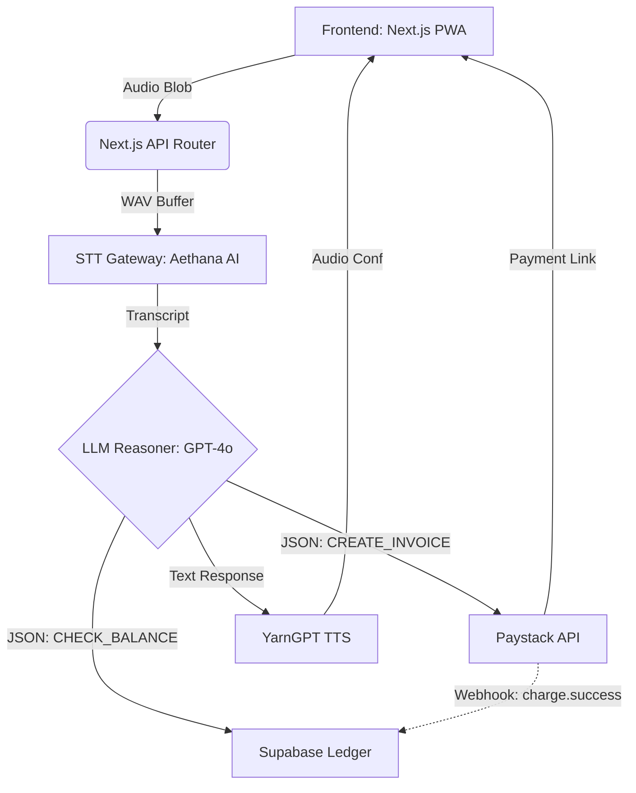

# PRODUCT REQUIREMENTS DOCUMENT (PRD)

**Project Name:** V2V (Voice-to-Value) Autonomous Merchant Protocol  
**Company Stage:** Seed / Hackathon MVP (3-Day Sprint Execution)  
**Target Platform:** Progressive Web App (PWA) / Mobile-First Web  

---

## 1. Executive Summary & Vision
V2V is an autonomous, voice-first operational banking agent built as a Progressive Web App (PWA). It is designed to bring millions of underbanked, orally-driven informal merchants and high-velocity digital creators into the formal banking fold. By leveraging localized speech processing, advanced LLM reasoning, and production-grade API integrations (Paystack & Access Bank), V2V transforms spoken language—English, Yoruba, or Pidgin—into instantaneous financial actions, automated B2B invoices, and interactive micro-negotiations.

## 2. The Problem & Market Opportunity
- **The Interface Friction:** Small-scale commercial operators lose hours daily navigating dense, visual fintech spreadsheets, complex accounting apps, or clunky POS hardware interfaces.
- **The Trust Gap:** B2B informal logistics are plagued by settlement delays. Transacting businesses lack immediate tools to dynamically generate secure payment infrastructure on the fly while handling physical deliveries.
- **The Financial Exclusion:** Traditional financial products (savings accounts, liquidity ledgers) fail to tap into informal cash flows because tools do not accommodate oral-first, multi-lingual business routines.

---

## 3. Core Features & User Flows (3-Day MVP Scope)

### 3.1 Adaptive Multi-Lingual Voice Ingestion Layer (Frontend -> STT)
- **Functional Description:** A lightweight, stream-capable microphone interface built into a responsive PWA layout.
- **User Flow:** User presses a single, highly visible button. The PWA records audio via `MediaRecorder` API. Upon release, the audio buffer is sent to the backend.
- **State Machine:** UI transitions dynamically (`IDLE` -> `RECORDING` -> `UPLOADING` -> `PARSING` -> `SUCCESS` / `ERROR`).
- **Processing:** Primary STT via Aethana AI (localized accents), with OpenAI Whisper as a fallback.

### 3.2 Intelligent Intent Parsing (LLM Reasoner)
- **Functional Description:** An LLM abstraction framework that reads plain text transcripts and converts them into structured JSON actions.
- **Strict JSON Intents:**
  1. `CREATE_INVOICE`: E.g., *"Invoice Café One ₦150,000 for coffee supplies."* -> `{ intent: "CREATE_INVOICE", client: "Cafe One", amount: 150000, memo: "Coffee supplies" }`
  2. `CHECK_BALANCE`: E.g., *"Check my business savings balance."* -> `{ intent: "CHECK_BALANCE", account_type: "high_yield_sub_account" }`
  3. `RUN_NEGOTIATION`: E.g., *"Supplier Alao wants ₦50,000 but check our cash flow."* -> `{ intent: "RUN_NEGOTIATION", counterparty: "Alao", requested_amount: 50000 }`
- **Voice Response:** Uses YarnGPT TTS to read back the action in natural Nigerian character voices.

### 3.3 Seamless Invoicing Infrastructure (Paystack Engine)
- **Functional Description:** Direct server-to-server integration mapping payment requests to digital checkout gateways.
- **Execution Lifecycle:** Once a `CREATE_INVOICE` JSON is generated, the backend calls the Paystack Payment Pages API (`sk_test` keys). A unique checkout page URL is generated and presented to the user.
- **Native Sharing:** The PWA generates a WhatsApp deep link containing the Paystack URL for instant sharing with the buyer.

### 3.4 Liquidity Ledger (Simulated Access Bank Engine)
- **Functional Description:** A persistent, transactional accounting engine tracking high-yield business sub-accounts.
- **Automation Loop:** A backend webhook endpoint listens for Paystack `charge.success` events. Upon verification, the ledger (Supabase DB) credits the merchant's balance and triggers a UI update.

### 3.5 The Spice: Café One On-Demand Procurement
- **Functional Description:** A specialized voice portal linking workspace logistics with commercial settlement systems.
- **Real-world Use Case:** "Book a creator workspace room for 2 hours and settle the invoice through my Paystack business wallet balance." Processes availability and fires a transaction instantly.

---

## 4. System Architecture

---

## 5. Non-Functional Requirements & Success Metrics
- **Latency Optimization:** End-to-end processing delay must remain below **2.4 seconds**.
- **Fault-Tolerant Routing:** Seamless fallback from Aethana STT to OpenAI Whisper if endpoints fail.
- **Data Accuracy:** Minimum extraction threshold of 92% accuracy regarding quantitative financial values before hitting Paystack hooks.
- **Premium Aesthetics:** Zero hardcoded colors. 100% adherence to CSS variables, modern micro-animations, glassmorphism, and Shadcn UI.

---

## 6. Team Assignments
- **Eyitayo (Frontend UI/State):** Shadcn setup, central audio button, UI state machine, mock dashboard views.
- **Demilade (Backend/APIs):** Next.js API routes, Supabase ledger schema, Paystack webhook listener.
- **Adepitan (Mobile/Hardware):** `MediaRecorder` integration, PWA manifesting, WhatsApp native sharing.
- **Precious (ML/Data Pipeline):** Aethana AI STT integration, LLM strict JSON parsing, YarnGPT TTS pipeline, latency optimization.